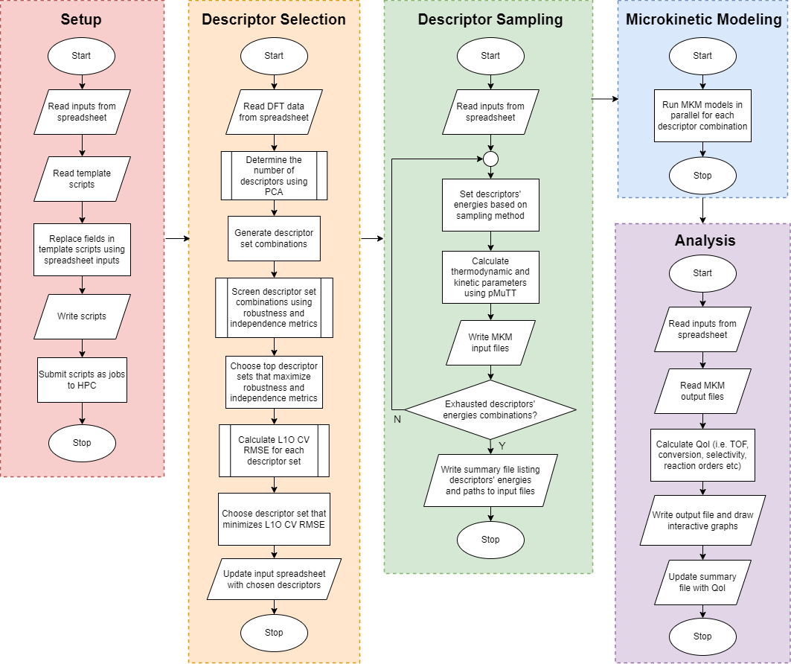

===================
Overview
===================

Software Overview 
-------------------------------

The software DescMAP is modular to accomplish clear tasks. The modules are run sequentially as illustrated by the overall workflow above. 

The setup module starts the program. It reads the template files and replace fields corresponding to the input spreadsheet provided by the user.
Then it creates the necessary folders, Python scripts, and job-submission scripts, and submits them to the workload manager.

The software currently supports two types of descriptors: electronic descriptors such as species binding energies, and geometric descriptors such as generalized coordination number.
If the user did not supply descriptors, the software selects electronic descriptors based on inputted DFT data.

To establish microkinetic models, DescMAP is integrated with MKM software CHEMKIN and openMKM.
The MKM simulations are run in parallel, a task handled by a SLURM job array to enable efficient scaling based on HPC resources.

After all the MKM models have converged, the analysis module is run.
DescMAP enables writing the kinetic performances to an output spreadsheet and plotting interactive HTML or static graphs using the Plotly library. 

